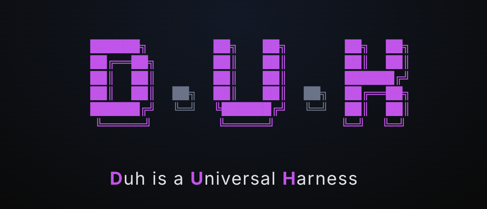
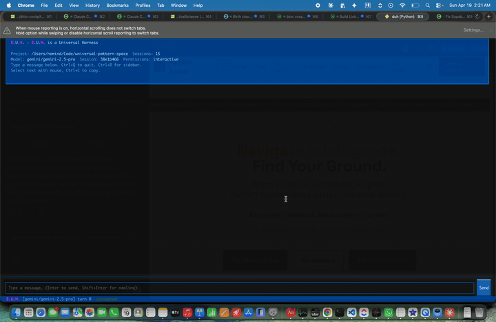

<div align="center">



<br>

*One harness. Any model. Your machine.*

[](https://github.com/nikhilvallishayee/duh/actions/workflows/ci.yml)
[](https://pypi.org/project/duh-cli/)
[]()
[]()
[]()
[]()
[](LICENSE)

**[Website](https://nikhilvallishayee.github.io/duh/site/)** | **[Comparisons](https://nikhilvallishayee.github.io/duh/site/comparisons.html)** | **[Getting Started](https://nikhilvallishayee.github.io/duh/site/getting-started.html)** | **[Security](https://nikhilvallishayee.github.io/duh/site/security.html)**

</div>

---

## Demo

<video src="docs/site/assets/duh-tui-demo.mp4" poster="docs/site/assets/duh-tui-demo-poster.jpg" width="720" autoplay loop muted playsinline>
  
</video>

*(GIF fallback shown above on platforms that do not render `<video>`. Source assets live under [`docs/site/assets/`](docs/site/assets/).)*

---

```
$ duh -p "fix the bug in auth.py"
⠋ Thinking...
I'll read the file first to understand the issue.

⠸ Running Read(file="auth.py")
Found the bug: token validation checks `expires_at < now` but should be `<=` —
tokens expiring at exactly the current second are incorrectly rejected.

⠹ Running Edit(file="auth.py", old_string="expires_at < now", new_string="expires_at <= now")
✓ Applied edit to auth.py (line 42).

⠼ Running Bash(command="python -m pytest tests/test_auth.py -q")
...........
11 passed in 0.43s

Done in 3 turns.
```

---

A universal, open-source AI coding agent. One harness, any provider — Anthropic Claude, OpenAI API, ChatGPT Plus/Pro subscription (Codex-family models), Google Gemini, Groq, local Ollama, or a deterministic stub for tests. Drop-in compatible with the Claude Agent SDK NDJSON protocol, so it can replace `claude` wherever that binary is expected.

## Install

```bash
# From source (recommended during alpha)
git clone https://github.com/nikhilvallishayee/duh
cd duh
python3.12 -m venv .venv && source .venv/bin/activate
pip install -e ".[dev]"

# From PyPI
pip install duh-cli                    # core: Anthropic + OpenAI + Gemini + Groq + Ollama (native SDKs)
pip install 'duh-cli[rich]'            # + Rich TUI rendering
pip install 'duh-cli[bridge]'          # + WebSocket remote bridge
pip install 'duh-cli[attachments]'     # + PDF attachment support (pdfplumber)
pip install 'duh-cli[security]'        # + vulnerability monitoring (ruff, pip-audit, detect-secrets, cyclonedx)
pip install 'duh-cli[litellm]'         # + LiteLLM fallback for long-tail providers (opt-in, see ADR-075)
pip install 'duh-cli[all]'             # everything above
```

As of v0.8.0, `duh-cli` ships **native adapters** for Anthropic, OpenAI, Gemini, Groq, and Ollama — no LiteLLM in the default install path. LiteLLM is now an **opt-in fallback** (`duh-cli[litellm]`) for providers without a native adapter (Azure, Bedrock, Vertex, Together, Cohere, Mistral, …). See [ADR-075](docs/adrs/ADR-075-drop-litellm-native-adapters.md) for the rationale (supply-chain hardening + native feature fidelity: Anthropic `cache_control`, Gemini `thinking_budget`, Groq rate-limit headers).

## Quick start

```bash
duh -p "fix the bug in auth.py"                                  # print mode, auto-detect provider
duh --provider anthropic --model claude-sonnet-4-6 -p "hello"    # force Claude
duh --provider openai --model gpt-5.2-codex -p "refactor db"     # ChatGPT Plus/Pro Codex (OAuth)
duh                                                              # interactive REPL
duh doctor                                                       # diagnostics + health checks
duh security scan                                                # vulnerability scan (SARIF output)
duh security init --non-interactive                              # set up security policy
duh security doctor                                              # scanner health check
```

## Providers

All six first-class providers use **native SDKs** — no LiteLLM in the default install path (ADR-075).

| Provider | Auth | Example models |
|---|---|---|
| **Anthropic** | `ANTHROPIC_API_KEY` env var or `/connect anthropic` | `claude-sonnet-4-6`, `claude-opus-4-6`, `claude-haiku-4-5` |
| **OpenAI API** | `OPENAI_API_KEY` env var or `/connect openai` (API key) | `gpt-4o`, `o1`, `o3` |
| **OpenAI ChatGPT** (Codex) | `/connect openai` → PKCE OAuth against `auth.openai.com`; tokens stored in `~/.config/duh/auth.json` (0600). See [ADR-051](docs/adrs/ADR-051-oauth-provider-authentication.md), [ADR-052](docs/adrs/ADR-052-chatgpt-codex-adapter.md). | `gpt-5.2-codex`, `gpt-5.1-codex`, `gpt-5.1-codex-max`, `gpt-5.1-codex-mini` |
| **Gemini** | `GEMINI_API_KEY` env var or `/connect gemini` (free at [aistudio.google.com](https://aistudio.google.com)) | `gemini-2.5-pro`, `gemini-2.5-flash`, `gemini-3.1-pro-preview` |
| **Groq** | `GROQ_API_KEY` env var or `/connect groq` (free at [console.groq.com](https://console.groq.com)) | `llama-3.3-70b-versatile`, `openai/gpt-oss-120b`, `llama-3.1-8b-instant` |
| **Ollama** | Local daemon on `localhost:11434`, no key | Any locally-pulled model |
| **LiteLLM** (opt-in, ADR-075) | `pip install 'duh-cli[litellm]'` + provider-specific env vars | `azure/gpt-4o`, `bedrock/anthropic.claude-3-5-sonnet`, … |
| **Stub** | `DUH_STUB_PROVIDER=1` | Deterministic canned response for tests / offline runs |

Provider and model auto-detect: give `--model gpt-5.2-codex` and D.U.H. will route to the ChatGPT/Codex Responses endpoint if OAuth exists; otherwise it falls back to the standard OpenAI Chat Completions adapter with your API key. `--model gemini-2.5-pro` routes to the native `google-genai` adapter; `--model groq/llama-3.3-70b-versatile` routes to the native `groq` SDK.

## Slash commands (REPL)

`/help` `/model` `/connect` `/models` `/cost` `/status` `/context` `/changes` `/git` `/tasks` `/brief` `/search` `/template` `/plan` `/pr` `/undo` `/jobs` `/health` `/errors` `/theme` `/mode` `/clear` `/compact` `/snapshot` `/exit`

Plus `Ctrl+K` for the **command palette** (fuzzy search across every slash command, model, provider, and recent file) and `Ctrl+T` to cycle **themes** (dark / light / high-contrast).

Run `/help` in the REPL for the full description of each command. Highlights: `/connect openai` runs the ChatGPT OAuth flow; `/connect gemini` / `/connect groq` prompt for the API key and store it under `~/.config/duh/auth.json` (0600); `/snapshot` takes a ghost filesystem snapshot you can `apply` or `discard`; `/plan` switches to design-first two-phase execution; `/pr list|view|diff|checks` integrates with `gh`; `/errors` shows the last N errors from the bounded in-session buffer; `/theme` cycles TUI themes.

## Built-in tools

`Read`, `Write`, `Edit`, `MultiEdit`, `Bash`, `Glob`, `Grep`, `Skill`, `ToolSearch`, `WebFetch`, `WebSearch`, `Task`, `Agent`, `Swarm`, `EnterWorktree`, `ExitWorktree`, `NotebookEdit`, `TestImpact`, `MemoryStore`, `MemoryRecall`, `HTTP`, `Docker`, `Database`, `GitHub`, `TodoWrite`, `AskUserQuestion`, plus `LSP` (deferred, loaded via `ToolSearch`).

**`WebSearch`** is zero-config: if no API key is set, it falls back to DuckDuckGo (Instant Answer API → HTML scrape) so the tool always returns something usable. Priority chain: `SERPER_API_KEY` → `TAVILY_API_KEY` → `BRAVE_SEARCH_API_KEY` → DDG IA → DDG HTML. Tune the per-request timeout with `DUH_WEBSEARCH_TIMEOUT` (default `5` seconds).

## Multi-agent

D.U.H. spawns child engines on demand. Two entry points:

- **`Agent`** — one subagent, synchronous result.
- **`Swarm`** — 1–5 subagents in parallel via `asyncio.gather` (partial failure tolerant).

Both accept `agent_type` (`general` / `coder` / `researcher` / `planner` / `reviewer` / `subagent`) and `model`. Since v0.8.0 the `model` field takes **generic tiers** resolved per-provider:

| Tier | Description | Resolves to (parent on Anthropic) | …on Gemini | …on Groq |
|---|---|---|---|---|
| `small` | Cheapest / fastest | `claude-haiku-4-5` | `gemini-2.5-flash` | `llama-3.1-8b-instant` |
| `medium` | Balanced default | `claude-sonnet-4-6` | `gemini-2.5-pro` | `llama-3.3-70b-versatile` |
| `large` | Strongest reasoning | `claude-opus-4-6` | `gemini-3.1-pro-preview` | `openai/gpt-oss-120b` |
| `inherit` (default) | Use parent's model unchanged | — | — | — |

This means a Gemini-parent → `"small"` child never 404s asking for `"haiku"`. Literal model names (`claude-haiku-4-5`, `gemini-2.5-flash`, …) are still accepted for backwards compatibility. See [docs/wiki/Multi-Agent.md](docs/wiki/Multi-Agent.md) and [ADR-012](docs/adrs/ADR-012-multi-agent.md). Coordinator mode (`duh --coordinator`) turns the main agent into a pure orchestrator that delegates everything to subagents.

## Security

D.U.H. ships a three-layer pluggable security module (ADR-053 + ADR-054) that addresses every published agent RCE in the 2024-2026 CVE corpus:

**Layer 1 — Vulnerability monitoring (`duh security` CLI):**
- 13 scanners across 3 tiers: Minimal (ruff-sec, pip-audit, detect-secrets, cyclonedx-sbom + 5 D.U.H.-specific scanners), Extended (semgrep, osv-scanner, gitleaks, bandit), Paranoid (GitHub Actions CodeQL, Scorecard, Dependabot)
- D.U.H.-specific scanners detect project-file RCE (CVE-2025-59536), MCP tool poisoning (CVE-2025-54136), sandbox bypass (CVE-2025-59532), command injection (CVE-2026-35022), and OAuth hardening violations
- SARIF output for GitHub Code Scanning, delta mode (`--baseline`), exception management with expiry
- `duh security init` wizard, `duh security doctor`, pre-push git hook installer

**Layer 2 — Runtime hardening (ADR-054):**
- **Taint propagation**: `UntrustedStr` subclass tags every string with its origin (`user_input`, `model_output`, `tool_output`, `file_content`, `mcp_output`, `network`) and propagates through all string operations
- **Confirmation tokens**: HMAC-bound tokens prevent model-originated tainted strings from reaching dangerous tools (Bash, Write, Edit) without explicit user confirmation
- **Lethal trifecta check**: Sessions with simultaneous read-private + read-untrusted + network-egress capabilities require explicit acknowledgement (`--i-understand-the-lethal-trifecta`)
- **MCP Unicode normalization**: NFKC normalization + rejection of zero-width, bidi, tag, and variation selector characters in MCP tool descriptions (GlassWorm defense)
- **Per-hook filesystem namespacing**: Each hook gets a private temp directory; cross-hook file access is blocked
- **PEP 578 audit hook bridge**: `sys.addaudithook` telemetry on `open`, `subprocess.Popen`, `socket.connect`, `exec`, `import pickle` — sub-500ns fast path
- **Signed plugin manifests**: TOFU trust store with sigstore-ready verification and revocation
- **Provider differential fuzzer**: Hypothesis property tests ensure all 5 adapters parse tool_use identically

**Layer 3 — Sandboxing:**
Shell commands and MCP stdio servers are wrapped by the host OS sandbox: **macOS Seatbelt** (`sandbox-exec` profiles), **Linux Landlock** (syscall-level filesystem access control), and a network policy layer that blocks outbound traffic unless explicitly allowed (see `duh/adapters/sandbox/`). Approval behaviour is controlled with `--approval-mode suggest|auto-edit|full-auto` (reads only / reads+writes / everything), with `--dangerously-skip-permissions` as the hard bypass.

## MCP (Model Context Protocol)

MCP servers connect via four transports: **stdio** (via the `mcp` SDK), **SSE**, **streamable HTTP**, and **WebSocket**. Configure with `--mcp-config <file-or-json>`. See [ADR-010](docs/adrs/ADR-010-mcp-integration.md) and [ADR-040](docs/adrs/ADR-040-multi-transport-mcp.md).

## Hooks

**29 lifecycle events** (6 original + 22 extended + AUDIT) including `PreToolUse`, `PostToolUse`, `PostToolUseFailure`, `SessionStart`, `SessionEnd`, `UserPromptSubmit`, `PermissionRequest`, `PreCompact`, `PostCompact`, `FileChanged`, `SubagentStart`, `Elicitation`, and more. Hooks support **glob matchers**, **blocking semantics** (a hook can refuse a tool call or rewrite its input), and both shell-command and Python-callable handlers. See [ADR-013](docs/adrs/ADR-013-hook-system.md), [ADR-036](docs/adrs/ADR-036-extended-hooks.md), [ADR-044](docs/adrs/ADR-044-hook-event-emission.md), [ADR-045](docs/adrs/ADR-045-hook-blocking-semantics.md).

## Tests and coverage

**6119 tests, 100% line coverage**, ~60s on a laptop. Includes 330+ security-specific tests (unit, integration, property-based), CVE replay fixtures, performance regression gates, and a **three-tier TUI E2E suite** (Rich `CaptureConsole` snapshots → PTY+pyte byte-level → tmux full-terminal, [ADR-074](docs/adrs/ADR-074-tui-e2e-testing.md)). CI runs on GitHub Actions with a `--cov-fail-under=85` floor (current actual: 100%).

```bash
.venv/bin/python -m pytest tests/                         # full suite
.venv/bin/python -m pytest tests/ --cov=duh               # with coverage
DUH_STUB_PROVIDER=1 .venv/bin/python -m pytest tests/     # force stub provider
```

## Selected ADRs

| # | Topic |
|---|---|
| [001](docs/adrs/ADR-001-project-vision.md) | Project vision: provider-agnostic, <5K LOC kernel |
| [005](docs/adrs/ADR-005-safety-architecture.md) | Safety architecture (schema + approval + patterns) |
| [009](docs/adrs/ADR-009-provider-adapters.md) | Provider adapter contract (`.stream()` async generator) |
| [021](docs/adrs/ADR-021-sdk-protocol.md) | Claude Agent SDK NDJSON protocol compatibility |
| [037](docs/adrs/ADR-037-platform-sandboxing.md) | Seatbelt / Landlock platform sandboxing |
| [039](docs/adrs/ADR-039-ghost-snapshots.md) | Ghost snapshots for `/snapshot` |
| [040](docs/adrs/ADR-040-multi-transport-mcp.md) | MCP stdio / SSE / HTTP / WebSocket transports |
| [045](docs/adrs/ADR-045-hook-blocking-semantics.md) | Hook blocking + input rewriting |
| [051](docs/adrs/ADR-051-oauth-provider-authentication.md) | OAuth provider authentication (ChatGPT Plus/Pro) |
| [052](docs/adrs/ADR-052-chatgpt-codex-adapter.md) | ChatGPT Codex adapter (Responses API) |
| [053](docs/adrs/ADR-053-continuous-vulnerability-monitoring.md) | Continuous vulnerability monitoring (pluggable scanner module) |
| [054](docs/adrs/ADR-054-llm-specific-security-hardening.md) | LLM-specific security hardening (taint propagation, confirmation tokens, lethal trifecta) |
| [073](docs/adrs/ADR-073-tui-parity-sprint.md) | TUI parity sprint (command palette, themes, streaming, virtualization) |
| [074](docs/adrs/ADR-074-tui-e2e-testing.md) | TUI E2E testing (3-tier: snapshot, PTY+pyte, tmux) |
| [075](docs/adrs/ADR-075-drop-litellm-native-adapters.md) | Drop LiteLLM as default; native Gemini + Groq adapters |

Full list: [docs/adrs/](docs/adrs/) (75 ADRs).

## Development

```bash
git clone https://github.com/nikhilvallishayee/duh
cd duh
python3.12 -m venv .venv && source .venv/bin/activate
pip install -e ".[dev]"

# Run tests
.venv/bin/python -m pytest tests/

# Run with coverage
.venv/bin/python -m pytest tests/ --cov=duh --cov-report=term

# Offline / deterministic mode (no real provider calls)
export DUH_STUB_PROVIDER=1
duh -p "hello"     # → "stub-ok"
```

Source layout:

```
duh/
  kernel/        # agentic loop, sessions, tasks, plan mode, undo, skills, memory
  ports/         # abstract provider / tool / approver interfaces
  adapters/      # anthropic, openai, openai_chatgpt, gemini, groq, ollama, stub,
                 # litellm_provider (opt-in fallback), mcp_executor, mcp_transports
    sandbox/     # seatbelt, landlock, network policy
  auth/          # credential store + OpenAI ChatGPT PKCE OAuth
  providers/     # provider registry + model resolution + tier mapping (small/medium/large)
  tools/         # 27 built-in tools (see list above)
  security/      # vulnerability monitoring, policy resolver, scanner plugins, CI templates
    scanners/    # 13 scanners (4 minimal, 5 D.U.H.-custom, 4 extended)
  cli/           # parser, main, runner, repl, sdk_runner, ndjson
  bridge/        # optional WebSocket remote bridge
  ui/            # Rich TUI rendering + command palette + themes
  plugins/       # plugin loader, signed manifests, TOFU trust store
  hooks.py       # 29-event hook system with per-hook FS namespacing
```

## License

Apache 2.0 — see [LICENSE](LICENSE).
